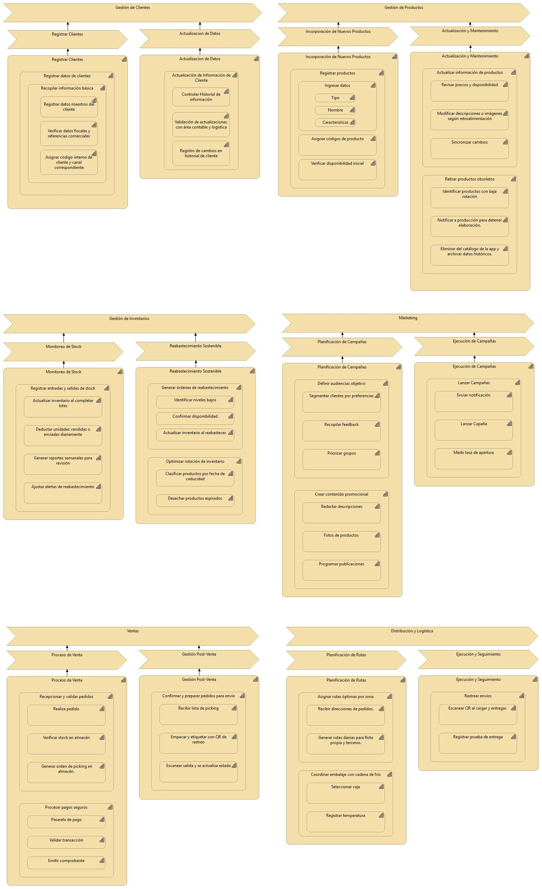

# Mapa de Capacidades — Plataforma **Cafrilosa**
---

## 📌 Tabla de contenido
- [¿Qué es un Mapa de Capacidades?](#qué-es-un-mapa-de-capacidades)
- [Estructura del Mapa](#estructura-del-mapa)
- [Mapa de Capacidades (Imagen)](#mapa-de-capacidades-imagen)
- [Módulos y Subcapacidades](#módulos-y-subcapacidades)
  - [1. Gestión de Clientes](#1-gestión-de-clientes)
  - [2. Administración de Datos](#2-administración-de-datos)
  - [3. Incorporación de Nuevos Productos](#3-incorporación-de-nuevos-productos)
  - [4. Gestión de Productos](#4-gestión-de-productos)
  - [5. Gestión de Inventarios (Stock)](#5-gestión-de-inventarios-stock)
  - [6. Reabastecimiento Sostenible](#6-reabastecimiento-sostenible)
  - [7. Marketing (Campañas)](#7-marketing-campañas)
  - [8. Ventas (Proceso y Post-venta)](#8-ventas-proceso-y-post-venta)
  - [9. Distribución y Logística](#9-distribución-y-logística)
- [Flujos clave — Vista del Cliente](#flujos-clave--vista-del-cliente)
- [KPIs sugeridos](#kpis-sugeridos)

---

## ¿Qué es un Mapa de Capacidades?
Un **Mapa de Capacidades** organiza, en lenguaje de negocio, **lo que el sistema debe ser capaz de hacer**. Ayuda a alinear a stakeholders, UX/UI y desarrollo; y sirve para priorizar alcance (MVP → releases).

### Estructura del Mapa
- **Módulos (nivel 1):** áreas funcionales (p. ej. Ventas, Inventario).
- **Subcapacidades (nivel 2):** funciones específicas por módulo.
- **Artefactos derivados:** flujos, pantallas, formularios, reglas/validaciones, reportes.

---

## Mapa de Capacidades (Imagen)

---

# Mapa de Capacidades del Sistema  
**ERP Comercial - Arquitectura por Capas (3 Niveles)**

> **Nivel 1:** Módulo  
> **Nivel 2:** Subproceso  
> **Nivel 3:** Tarea específica (acción atómica)

---

## 1. Gestión de Clientes

### 1.1 Registrar Clientes
| Tarea | Descripción |
|------|-------------|
| Recopilar información básica | Ingresar nombre, contacto, dirección, canal |
| Registrar datos maestros del cliente | Crear registro único en sistema central |
| Verificar datos fiscales y referencias comerciales | Validar RUT/CUIT, historial crediticio |
| Asignar código interno de cliente y canal / responsable | Generar ID único + vincular a vendedor |

### 1.2 Actualización de Datos
| Tarea | Descripción |
|------|-------------|
| Actualización de información de cliente | Editar campos modificables |
| Controlar historial de información | Mantener log de versiones anteriores |
| Validación de actualizaciones con áreas contable y logística | Aprobación cruzada antes de guardar |
| Registro de cambios en historial del cliente | Auditoría automática con timestamp |

---

## 2. Gestión de Productos

### 2.1 Incorporación de Nuevos Productos
| Tarea | Descripción |
|------|-------------|
| Registrar productos | Alta en catálogo maestro |
| Ingresar datos: Tipo | Clasificar (perecedero, seco, etc.) |
| Ingresar datos: Nombre | Nombre comercial y técnico |
| Ingresar datos: Características | Peso, volumen, conservación |
| Asignar códigos de producto | SKU, EAN, interno |
| Verificar disponibilidad inicial | Confirmar stock físico vs. sistema |

### 2.2 Actualización y Mantenimiento
| Tarea | Descripción |
|------|-------------|
| Actualizar información de productos | Modificar cualquier campo |
| Revisar precios y disponibilidad | Ajuste masivo o individual |
| Modificar descripciones e imágenes según retroalimentación | Actualización desde marketing/ventas |
| Sincronizar cambios | Push a app móvil, web, POS |
| Retirar productos obsoletos | Marcar como inactivo |
| Identificar productos con baja rotación | Reporte automático < 3 ventas/mes |
| Notificar a producción para detener elaboración | Email/Slack automático |
| Eliminar del catálogo de la app y archivar datos históricos | Soft-delete + backup |

---

## 3. Gestión de Inventarios

### 3.1 Monitoreo de Stock
| Tarea | Descripción |
|------|-------------|
| Registrar entradas y salidas de stock | Por recepción, venta, ajuste |
| Actualizar inventario al completar lotes | Cierre de producción |
| Deducir unidades vendidas o enviadas diariamente | Job nocturno automático |
| Generar reportes semanales para revisión | PDF/Excel por email |
| Ajustar alertas de reabastecimiento | Umbral dinámico por rotación |

### 3.2 Reabastecimiento Sostenible
| Tarea | Descripción |
|------|-------------|
| Generar órdenes de reabastecimiento | Automático o manual |
| Identificar niveles bajos | Stock < punto de pedido |
| Confirmar disponibilidad | Con proveedor o producción |
| Actualizar inventario al reabastecer | Recepción física + sistema |
| Optimizar rotación de inventario | FIFO, FEFO, ABC |
| Clasificar productos por fecha de caducidad | Alertas por lote |
| Desechar productos expirados | Registro de merma |

---

## 4. Marketing

### 4.1 Planificación de Campañas
| Tarea | Descripción |
|------|-------------|
| Definir audiencias objetivo | Filtros: zona, compras, preferencias |
| Segmentar clientes por preferencias | Tags: vegano, sin gluten, etc. |
| Recopilar feedback | Encuestas post-compra |
| Priorizar grupos | Scoring por LTV |
| Crear contenido promocional | Plantillas reutilizables |
| Redactar descripciones | Copy optimizado |
| Fotos de productos | Galería por SKU |
| Programar publicaciones | Calendario integrado |

### 4.2 Ejecución de Campañas
| Tarea | Descripción |
|------|-------------|
| Lanzar campañas | Activación programada |
| Enviar notificación | Push, email, SMS |
| Lanzar campaña | Disparo masivo |
| Medir tasa de apertura | Reporte en tiempo real |

---

## 5. Ventas

### 5.1 Proceso de Venta
| Tarea | Descripción |
|------|-------------|
| Recepcionar y validar pedidos | App/web/POS |
| Realizar pedido | Confirmación inmediata |
| Verificar stock en almacén | Bloqueo temporal de unidades |
| Generar orden de picking en almacén | Lista impresa o digital |
| Procesar pagos seguros | Integración Stripe/Mercado Pago |
| Pasarela de pago | Redirección segura |
| Validar transacción | Callback + webhook |
| Emitir comprobante | PDF fiscal automático |

### 5.2 Gestión Post-Venta
| Tarea | Descripción |
|------|-------------|
| Confirmar y preparar pedidos para envío | Estado: "Listo para picking" |
| Recibir lista de picking | Desde almacén |
| Empacar y etiquetar con QR de rastreo | Código único por pedido |
| Escanear salida y actualizar estado | "En tránsito" |

---

## 6. Distribución y Logística

### 6.1 Planificación de Rutas
| Tarea | Descripción |
|------|-------------|
| Asignar rutas óptimas por zona | Algoritmo Google Maps/OR-Tools |
| Recibir direcciones de pedidos | Desde ventas |
| Generar rutas diarias para flota propia y terceros | PDF + app móvil |
| Coordinar embalaje con cadena de frío | Alertas de temperatura |
| Seleccionar caja | Según volumen/peso |
| Registrar temperatura | Sensor IoT o manual |

### 6.2 Ejecución y Seguimiento
| Tarea | Descripción |
|------|-------------|
| Rastrear envíos | GPS en tiempo real |
| Escanear QR al cargar y entregar | App conductor |
| Registrar prueba de entrega | Foto + firma digital |
---

## Flujos clave — Vista del Cliente
> El usuario **puede ver** productos sin iniciar sesión. Para **agregar al carrito** o **comprar**, **debe iniciar sesión**.

### 1) Landing pública
- Header (logo Cafrilosa), buscador, categorías.  
- Banners/promos, destacados, footer corporativo.  
- CTA: **Ingresar** / **Crear cuenta**.

### 2) Catálogo (público)
- Filtros (categoría, precio, disponibilidad) y ordenamientos.  
- Vista rápida (sin botón de carrito si no hay sesión).

### 3) Detalle de producto (público)
- Galería de **imágenes de Cafrilosa**, descripción, especificaciones, precio y stock.  
- **Agregar al carrito** → si no hay sesión, redirigir a **Login/Registro**.

### 4) Autenticación
- **Login:** correo + contraseña; “olvidé mi contraseña”.  
- **Registro:** nombre, correo, contraseña, aceptación de términos.  
- Validaciones claras (formato de correo y complejidad de contraseña).

### 5) Carrito (requiere sesión)
- Items, cantidades, subtotal, estimador de envío.  
- Editar/eliminar, “guardar para después”.  
- CTA **Ir a pagar**.

### 6) Checkout (requiere sesión)
- **Paso 1:** Dirección de envío (crear/seleccionar).  
- **Paso 2:** Método de envío (costo/plazo).  
- **Paso 3:** Método de pago (pasarela).  
- **Paso 4:** Revisión y confirmación.  
- Mensajes de error/success bien diseñados (sin 404).

### 7) Pago (pasarela)
- Redirección/embebido seguro.  
- Página **Pago exitoso** con número de pedido.

### 8) Confirmación y seguimiento
- Resumen del pedido, línea de tiempo de estados, comprobante descargable.  
- Link **Rastrear pedido**.

---

## KPIs sugeridos
- **Ventas:** conversión, ticket promedio, abandono de carrito.  
- **Inventario:** rotación, cobertura (días), quiebres, obsolescencia.  
- **Logística:** OTIF, tiempos de preparación/entrega, incidencias.  
- **Marketing:** CTR, CAC, ROI.

---
