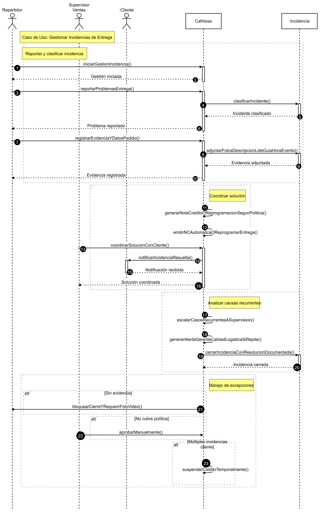
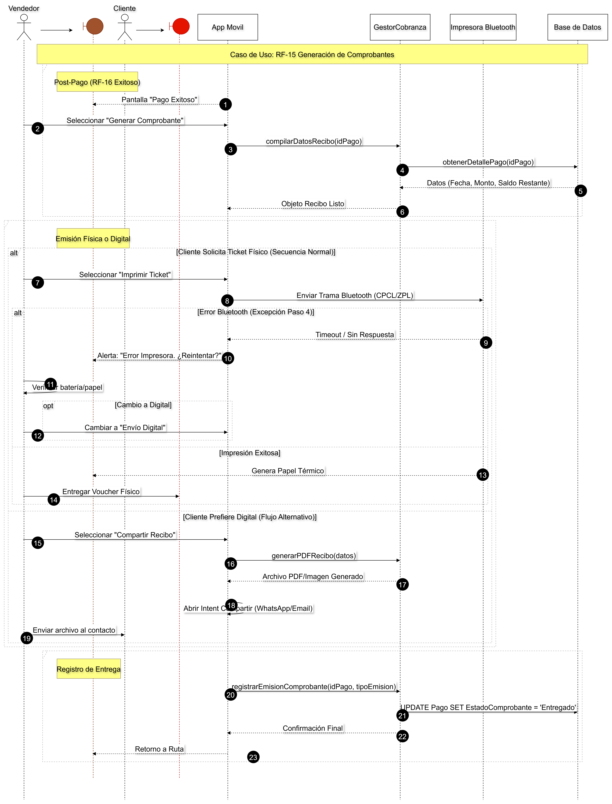

# Diagrama de Secuencia

## ¿Qué es un diagrama de secuencia?

Un diagrama de secuencia es un tipo de diagrama UML que muestra cómo los objetos interactúan en el tiempo mediante el intercambio de mensajes. Se usa para describir paso a paso el comportamiento de un escenario (caso de uso), mostrando participantes (actores y componentes) en la parte superior y las llamadas entre ellos como flechas verticales que representan la secuencia temporal.

Los diagramas de secuencia son útiles para:
- Visualizar la colaboración entre componentes durante un flujo concreto.
- Detectar dependencias, latencias y puntos donde debe manejarse errores o reintentos.
- Comunicar flujos a desarrolladores y stakeholders.
---
## Módulo de Planificación Territorial y Asignación de Cartera
### Caso de Uso: RF-01 Definición de Zonas de Cobertura

### Caso de Uso: RF-02 Diseño de Rutas de Visita

### Caso de Uso: RF-03 Asignación de Responsables

## Módulo de Gestión de Catálogos Maestros
### Caso de Uso: Administración de Clientes (RF-04 y relacionados)

### Caso de Uso: RF-05 Administracion de Productos

## Módulo de Toma y Registro de Pedidos
### Caso de Uso: RF-06 Captura de Pedidos en Campo

## Módulo de Validación y Preparación de Pedidos
### Caso de Uso: RF-07 Verificación de Existencias

### Caso de Uso: RF-08 Preparación Física (Picking & Packing)

## Módulo de Integración Financiera
### Caso de Uso: RF-09 Generación de Cuentas por Cobrar

## Módulo de Facturación y Legalización
### Caso de Uso: RF-10 Emisión de Documentos Fiscales

## Módulo de Entrega y Logística
### Caso de Uso: RF-11 Programación de Entregas

### Caso de Uso: RF-12 Ejecución de Entregas

### Caso de Uso: RF-13 Retiro de Devoluciones

## Módulo de Cobranzas y Recaudación
### Caso de Uso: RF-14 Registro de Pagos en Campo

### Caso de Uso: RF-15 Generación de Comprobantes

### Caso de Uso: RF-16 Seguimiento de Morosidad

### Caso de Uso: RF-17 Cierre de Caja

## Módulo de Devoluciones y Garantías
### Caso de Uso: RF-18 Solicitud de Devolución

### Caso de Uso: RF-19 Verificación Física de Devolución

### Caso de Uso: RF-20 Autorización y Retiro

### Caso de Uso: RF-21 Procesamiento en Bodega

## Módulo de Supervisión y Control de Gestión
### Caso de Uso: RF-22 Monitoreo de Rutas

### Caso de Uso: RF-23 Auditoría de Cartera

### Caso de Uso: RF-24 Gestión de Promociones

### Caso de Uso: RF-25 Reporte de Ventas por Vendedor

## Módulo de Autogestión del Cliente
### Caso de Uso: RF-26 Consulta de Estado de Cuenta

### Caso de Uso: RF-27 Solicitud de Pedidos (Autoservicio)

### Caso de Uso: RF-28 Reporte de Incidencias
